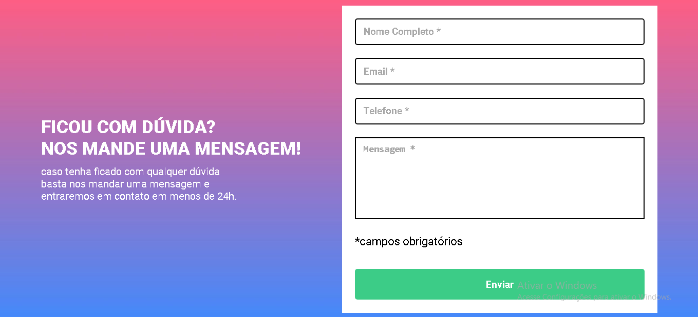
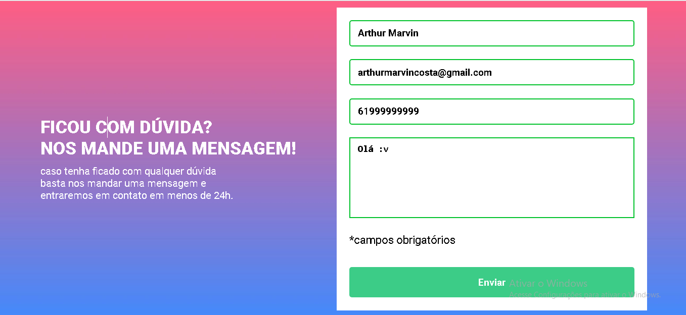
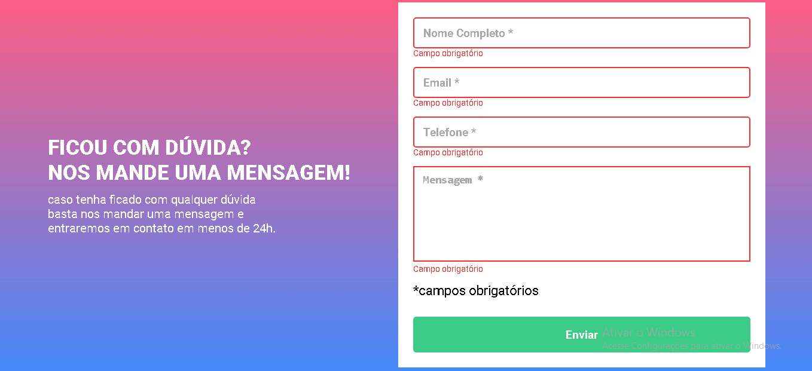
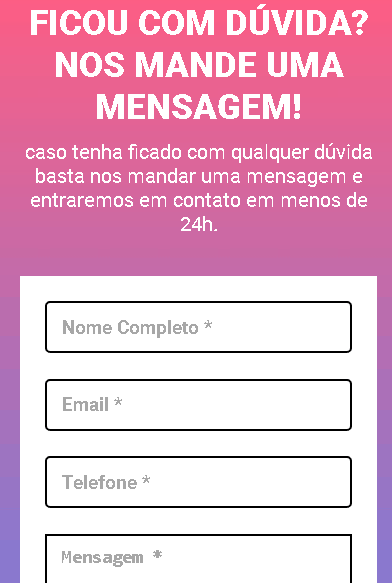

# formulario-com-validacao
Desafio de JS intermediário para criação de um formulário com validação

Validação confirmada:

Validação não confirmada:

Mobile:

Neste desafio trabalhei habilidades como HTML5, CSS3 e Javascript.
- Criação de formulários;
- Posicionamento de elementos no CSS;
- Validação de Dados no Javascript;
